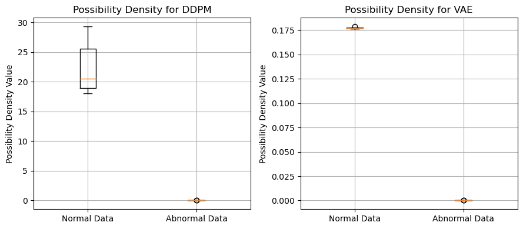

# Anormaly Detection Based on Graph Transformer and Generation Model

###### Team Members: Vincent Leopold Woeste, Shao Yanming, Heng Kok Chin

## Introduction

This repository is the model training and evaluation part of the course project for NUS CS5284 Graph Machine Learning. We utilize Graph Transformer and generation models including DDPM and VAE to detect anomalies in the graph data.

## Requirements

- Python 3.8
- PyTorch 2.1.2
- DGL 1.0.0
- NumPy 1.24.4
- Pandas 2.0.3
- NetworkX 3.1.0

## Dataset

The dataset used in this project is our own generated dataset. Due to the large size of the dataset, we only provide 3 batches of the dataset samples in the `data` folder. Each batch contains 32 graphs with 100 nodes. `h_[batch_id].pt` contains the node features of the graphs, `pe_[batch_id].pt` contains the positional encoding of the nodes, and `edge_index_[batch_id].pt` contains the edge information of the graphs.

## Model Definition and Training

In the `models.ipynb` notebook, we defined all the models and data processing functions used in this project. For each model, we used a seperate Python file to run the script. DDPM model is trained in `DDPM/ddpm_train.py`, VAE model is trained in `VAE/vae_train.py`. The trained model is stored in the `models` folder.

## Model Evaluation

We utilized the possibility density function of the reconstruction error to detect anomalies. The evaluation process is implemented in the `DDPM/ddpm_eval.py` and `VAE/vae_eval.py` scripts respectively, while `DDPM/ddpm_norm.py` and `VAE/vae_norm.py` are used to calculate the normality mean value and standard deviation of the normal training data.

## Results

The results of the model evaluation are stored in the `results` folder, with the cardinal Torch Tensor saved. Both of the DDPM and VAE models are shown to be able to detect anomalies in the graph data, with the DDPM model showing better performance.

We visualize the possibility density value of the reconstruction error in the following figure:

The `report_gml&rlt.ipynb` notebook is the experiment part for the report of this course project, which contains the detailed information of the implementation and results.

## Conclusion

In this project, we implemented the Graph Transformer and generation models to detect anomalies in the graph data. The results show that the models are able to detect anomalies effectively, with the DDPM model showing better performance. Due to the time constraint of the course project, we only used a vary simple and naive evaluation method. More advanced evaluation methods like ordinal differential equation (ODE) can be used to improve the performance.
